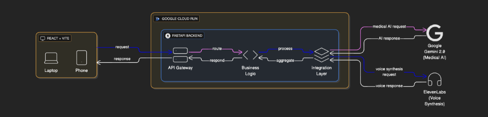

# 🏥 MediVoice AI - Multilingual Voice Medical Assistant

**Winning Solution for ElevenLabs + Google Cloud AI Hackathon**

MediVoice AI is an intelligent, multilingual voice medical assistant that combines the power of Google Gemini AI with ElevenLabs' natural voice synthesis to provide accessible healthcare guidance in 10+ languages.

## 🎬 Demo & Live App

- **🎥 Demo Video**: [Watch Demo on YouTube](https://www.youtube.com/watch?v=TVYbwB-6wnY)
- **🚀 Live Application**: [Try MediVoice Now](https://medivoice-web-409417803362.us-central1.run.app/)


---

## 📑 Table of Contents

- [Features](#-features)
- [Architecture](#-architecture)
- [Quick Start](#-quick-start)
- [Usage](#-usage)
- [API Documentation](#-api-documentation)
- [Technology Stack](#-technology-stack)
- [Project Structure](#-project-structure)
- [Configuration](#-configuration)
- [Troubleshooting](#-troubleshooting)
- [Roadmap](#-roadmap)
- [License](#-license)

---

## 🌟 Features

### 🗣️ **Multilingual Voice Conversations**
- Support for **10+ languages**: English, Spanish, Hindi, Arabic, Chinese, French, German, Portuguese, Russian, Japanese
- Natural, empathetic voice responses using **ElevenLabs** text-to-speech
- Real-time audio visualization and playback
- Voice input processing with speech-to-text

### 🤖 **Intelligent Medical AI**
- Powered by **Google Gemini 2.0 Flash** for fast, accurate medical guidance
- **Diagnostic Flow**: Asks clarifying questions before prescribing (duration, severity, symptoms)
- **Holistic Care**: Provides lifestyle, diet, and precautionary advice with every consultation
- Context-aware conversations with medical history tracking
- Emergency detection and urgent care recommendations
- Symptom analysis and preliminary health assessments
- Medication information with specific dosages and instructions

### 🎨 **Premium User Experience**
- Modern, responsive dark-mode interface
- Smooth animations and transitions
- Intuitive voice-first design
- Real-time conversation display with message history
- Language switcher with flag indicators
- **PDF Report Generation**: Download professional medical consultation summaries

### 🔒 **Safety & Privacy**
- Clear disclaimers about AI limitations
- Automatic emergency detection with immediate alerts
- HIPAA-compliant design principles
- No permanent storage of personal health information
- Secure API key management

---

## 🏗️ Architecture

### System Architecture Diagram



### Deployment Strategy
- **Frontend**: Deployed as a Docker container on **Google Cloud Run** (Service: `medivoice-web`).
- **Backend**: Deployed as a Docker container on **Google Cloud Run** (Service: `medivoice-api`).
- **Communication**: Frontend communicates with Backend via secure HTTPS REST API calls.

---

## 🚀 Quick Start

### Prerequisites

Ensure you have the following installed:
- **Python 3.11+**
- **Node.js 20.19+**
- **Google Cloud SDK** (for deployment)
- **Google Gemini API Key** and **ElevenLabs API Key**

### Local Development

#### 1. Clone & Setup Backend
```bash
git clone https://github.com/6736-shafi/MediVoice.git
cd MediVoice/backend

# Virtual Env
python3 -m venv venv
source venv/bin/activate
pip install -r ../requirements.txt

# Configure Environment
cp ../.env.example ../.env
# Edit .env with your keys: GOOGLE_API_KEY, ELEVENLABS_API_KEY
```

Run Backend:
```bash
python main.py
```

#### 2. Setup Frontend
```bash
cd ../frontend
npm install

# Configure Environment
cp .env.example .env
# Set VITE_BACKEND_URL=http://localhost:8000
```

Run Frontend:
```bash
npm run dev
```

**Current Production Services:**
- **Frontend**: https://medivoice-web-409417803362.us-central1.run.app/
- **Backend API**: https://medivoice-api-409417803362.us-central1.run.app/
- **Region**: us-central1 (Iowa, USA)
- **Platform**: Google Cloud Run

---

## 📖 Usage

1. **Select Your Language**: Choose from 10+ supported languages
2. **Start Conversation**: Type or speak your symptoms
3. **Get AI Response**: Receive intelligent medical guidance with voice
4. **Continue Dialogue**: Ask follow-up questions naturally
5. **Generate Report**: Download a PDF summary of your consultation

---

## 🛠️ Technology Stack

### Backend
- **FastAPI**: Modern, fast web framework
- **Google Gemini 2.0 Flash**: Advanced AI for medical reasoning
- **ElevenLabs API**: Multilingual voice synthesis
- **Python 3.11**: Core programming language

### Frontend
- **React 18**: UI framework
- **Vite**: Build tool and dev server
- **Axios**: HTTP client
- **Lucide React**: Icon library

### Cloud Infrastructure
- **Google Cloud Run**: Serverless container platform
- **Docker**: Containerization

---

## ⚙️ Configuration

### Environment Variables

| Variable | Context | Description |
|----------|---------|-------------|
| `GOOGLE_API_KEY` | Backend | Google Gemini API key |
| `ELEVENLABS_API_KEY` | Backend | ElevenLabs API key |
| `ALLOWED_ORIGINS` | Backend | CORS allowed origins (CSV) |
| `VITE_BACKEND_URL` | Frontend | URL of the deployed backend API |

---

## 🔧 Troubleshooting

See [TECHNICAL_DOCUMENTATION.md](TECHNICAL_DOCUMENTATION.md) for detailed troubleshooting steps.

---

## 📄 License

MIT License - see LICENSE file for details

---

**Made with ❤️ using Google Cloud AI and ElevenLabs**
