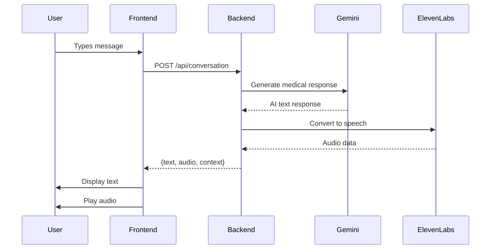

# MediVoice AI - Technical Documentation

**Version:** 1.0.0  
**Last Updated:** December 28, 2025  
**Author:** MediVoice AI Team

---

## Table of Contents

1. [System Overview](#1-system-overview)
2. [Architecture](#2-architecture)
3. [Technology Stack](#3-technology-stack)
4. [Backend Implementation](#4-backend-implementation)
5. [Frontend Implementation](#5-frontend-implementation)
6. [API Reference](#6-api-reference)
7. [Service Layer](#7-service-layer)
8. [Data Models](#8-data-models)
9. [Security & Privacy](#9-security--privacy)
10. [Deployment](#10-deployment)
11. [Performance Optimization](#11-performance-optimization)
12. [Testing](#12-testing)
13. [Monitoring & Logging](#13-monitoring--logging)
14. [Future Enhancements](#14-future-enhancements)

---

## 1. System Overview

### 1.1 Purpose

MediVoice AI is a multilingual voice medical assistant designed to provide accessible healthcare guidance through natural language conversations. The system combines advanced AI capabilities with voice synthesis to break language barriers in healthcare.

### 1.2 Key Capabilities

- **Multilingual Support**: 10+ languages with natural voice synthesis
- **Medical AI**: Context-aware medical guidance using Google Gemini 2.0 Flash
- **Voice Interface**: Speech-to-text input and text-to-speech output
- **Emergency Detection**: Automatic identification of urgent medical situations
- **Conversation History**: Maintains context across multiple interactions

### 1.3 Target Users

- Patients seeking preliminary medical guidance
- Non-English speakers needing healthcare information
- Users in underserved areas with limited healthcare access
- Individuals requiring 24/7 medical information

---

## 2. Architecture

### 2.1 High-Level Architecture

```
┌─────────────────────────────────────────────────────────────┐
│                     PRESENTATION LAYER                       │
│                  (React SPA - Port 5173)                     │
│                                                              │
│  Components:                                                 │
│  • Language Selector    • Voice Input Module                │
│  • Conversation Display • Audio Player                       │
│  • Emergency Alert UI   • Loading States                     │
└───────────────────────────┬─────────────────────────────────┘
                            │
                            │ REST API (JSON/HTTP)
                            │ CORS Enabled
                            │
┌───────────────────────────▼─────────────────────────────────┐
│                    APPLICATION LAYER                         │
│                  (FastAPI - Port 8000)                       │
│                                                              │
│  API Endpoints:                                              │
│  • POST /api/conversation  • POST /api/voice-input          │
│  • GET  /api/health        • GET  /api/languages            │
│                                                              │
│  Middleware:                                                 │
│  • CORS Handler           • Error Handler                    │
│  • Request Validator      • Logger                           │
└───────────────────────────┬─────────────────────────────────┘
                            │
                            │
┌───────────────────────────▼─────────────────────────────────┐
│                      SERVICE LAYER                           │
│                                                              │
│  ┌──────────────────┐  ┌──────────────────┐                │
│  │ Gemini Service   │  │ElevenLabs Service│                │
│  │                  │  │                  │                │
│  │ • Prompt Mgmt    │  │ • Voice Synth    │                │
│  │ • Context Track  │  │ • Language Map   │                │
│  │ • Emergency Det  │  │ • Audio Encode   │                │
│  └──────────────────┘  └──────────────────┘                │
│                                                              │
│  ┌──────────────────┐                                       │
│  │ Speech Service   │                                       │
│  │                  │                                       │
│  │ • STT Processing │                                       │
│  │ • Audio Handling │                                       │
│  └──────────────────┘                                       │
└───────────────────────────┬─────────────────────────────────┘
                            │
                            │ API Calls
                            │
┌───────────────────────────▼─────────────────────────────────┐
│                   EXTERNAL SERVICES                          │
│                                                              │
│  ┌──────────────────┐  ┌──────────────────┐                │
│  │ Google Gemini    │  │   ElevenLabs     │                │
│  │ 2.0 Flash API    │  │   Voice API      │                │
│  │                  │  │                  │                │
│  │ • Medical AI     │  │ • TTS Engine     │                │
│  │ • Multilingual   │  │ • Voice Cloning  │                │
│  │ • Context Aware  │  │ • Multi-language │                │
│  └──────────────────┘  └──────────────────┘                │
└─────────────────────────────────────────────────────────────┘
```

### 2.2 Request Flow

#### Text Conversation Flow

```
1. User Input
   ↓
2. Frontend validates input
   ↓
3. POST /api/conversation
   {
     message: "I have a headache",
     language: "en",
     conversation_history: [...]
   }
   ↓
4. Backend receives request
   ↓
5. Gemini Service processes
   • Constructs medical prompt
   • Adds conversation context
   • Calls Gemini API
   • Parses response
   ↓
6. ElevenLabs Service processes
   • Receives AI text response
   • Maps language to voice
   • Calls ElevenLabs API
   • Encodes audio to base64
   ↓
7. Backend returns response
   {
     text_response: "...",
     audio_url: "data:audio/mpeg;base64,...",
     conversation_id: "...",
     medical_context: {...}
   }
   ↓
8. Frontend displays text
   ↓
9. Frontend plays audio
```

#### Voice Input Flow

```
1. User records voice
   ↓
2. Frontend captures audio
   ↓
3. POST /api/voice-input
   FormData: {audio: File, language: "en"}
   ↓
4. Speech Service processes
   • Receives audio file
   • Calls speech-to-text API
   • Returns transcription
   ↓
5. Frontend receives transcription
   ↓
6. Follows text conversation flow
```

### 2.3 Component Interaction



---

## 3. Technology Stack

### 3.1 Backend Technologies

| Technology | Version | Purpose |
|------------|---------|---------|
| **Python** | 3.11+ | Core programming language |
| **FastAPI** | 0.115+ | Web framework for API |
| **Uvicorn** | Latest | ASGI server |
| **Pydantic** | Latest | Data validation |
| **Google Generative AI** | Latest | Gemini API client |
| **ElevenLabs SDK** | Latest | Voice synthesis client |
| **python-dotenv** | Latest | Environment management |
| **python-multipart** | Latest | File upload handling |

### 3.2 Frontend Technologies

| Technology | Version | Purpose |
|------------|---------|---------|
| **React** | 18.3+ | UI framework |
| **Vite** | 6.4+ | Build tool & dev server |
| **Axios** | Latest | HTTP client |
| **Lucide React** | Latest | Icon library |
| **CSS3** | - | Styling & animations |

### 3.3 External APIs

| Service | Purpose | Documentation |
|---------|---------|---------------|
| **Google Gemini 2.0 Flash** | Medical AI reasoning | [Docs](https://ai.google.dev/docs) |
| **ElevenLabs** | Multilingual voice synthesis | [Docs](https://elevenlabs.io/docs) |

---

## 4. Backend Implementation

### 4.1 Project Structure

```
backend/
├── main.py                    # Application entry point
├── services/
│   ├── __init__.py
│   ├── gemini_service.py      # Gemini AI integration
│   ├── elevenlabs_service.py  # Voice synthesis
│   └── speech_service.py      # Speech-to-text
└── __pycache__/
```

### 4.2 Main Application (main.py)

#### FastAPI Configuration

```python
app = FastAPI(
    title="MediVoice AI",
    description="Multilingual Voice Medical Assistant",
    version="1.0.0"
)
```

#### CORS Configuration

```python
origins = os.getenv(
    "ALLOWED_ORIGINS", 
    "http://localhost:3000,http://localhost:5173"
).split(",")

app.add_middleware(
    CORSMiddleware,
    allow_origins=origins,
    allow_credentials=True,
    allow_methods=["*"],
    allow_headers=["*"],
)
```

#### Request/Response Models

```python
class ConversationRequest(BaseModel):
    message: str
    language: str = "en"
    patient_id: Optional[str] = None
    conversation_history: Optional[List[dict]] = []

class ConversationResponse(BaseModel):
    text_response: str
    audio_url: Optional[str] = None
    conversation_id: str
    language: str
    medical_context: Optional[dict] = None
```

### 4.3 Endpoint Implementations

#### Health Check Endpoint

```python
@app.get("/", response_model=HealthCheckResponse)
async def health_check():
    return {
        "status": "healthy",
        "version": "1.0.0",
        "services": {
            "gemini": "configured" if os.getenv("GOOGLE_API_KEY") else "not_configured",
            "elevenlabs": "configured" if os.getenv("ELEVENLABS_API_KEY") else "not_configured"
        }
    }
```

#### Conversation Endpoint

```python
@app.post("/api/conversation", response_model=ConversationResponse)
async def create_conversation(request: ConversationRequest):
    # Initialize services
    gemini_service = GeminiService()
    elevenlabs_service = ElevenLabsService()
    
    # Generate AI response
    ai_response = await gemini_service.generate_medical_response(
        user_message=request.message,
        conversation_history=request.conversation_history,
        language=request.language
    )
    
    # Generate voice audio
    audio_data = await elevenlabs_service.text_to_speech(
        text=ai_response["text"],
        language=request.language
    )
    
    return ConversationResponse(
        text_response=ai_response["text"],
        audio_url=audio_data["audio_url"],
        conversation_id=ai_response.get("conversation_id", "default"),
        language=request.language,
        medical_context=ai_response.get("medical_context")
    )
```

---

## 5. Frontend Implementation

### 5.1 Project Structure

```
frontend/
├── src/
│   ├── App.jsx          # Main application component
│   ├── App.css          # Component styles
│   ├── main.jsx         # React entry point
│   └── index.css        # Global styles
├── public/
├── index.html
├── package.json
└── vite.config.js
```

### 5.2 Key Components

#### App Component Structure

```jsx
function App() {
  // State management
  const [messages, setMessages] = useState([]);
  const [currentMessage, setCurrentMessage] = useState('');
  const [selectedLanguage, setSelectedLanguage] = useState('en');
  const [isLoading, setIsLoading] = useState(false);
  const [audioUrl, setAudioUrl] = useState(null);
  
  // API communication
  const sendMessage = async () => {
    // Send to backend
    // Handle response
    // Update UI
  };
  
  return (
    <div className="app-container">
      <LanguageSelector />
      <ConversationDisplay />
      <MessageInput />
      <AudioPlayer />
    </div>
  );
}
```

### 5.3 API Integration

```javascript
const API_BASE_URL = 'http://localhost:8000';

const sendMessage = async (message, language, history) => {
  const response = await axios.post(`${API_BASE_URL}/api/conversation`, {
    message,
    language,
    conversation_history: history
  });
  
  return response.data;
};
```

### 5.4 PDF Report Generation

**Technology:** jsPDF library

**Implementation:**

```javascript
import { jsPDF } from "jspdf";

const generateReport = async () => {
  // Fetch report data from backend
  const response = await fetch(`${API_BASE_URL}/api/report`, {
    method: 'POST',
    headers: { 'Content-Type': 'application/json' },
    body: JSON.stringify({
      conversation_history: conversation,
      language: selectedLanguage
    })
  });
  
  const data = await response.json();
  const reportData = JSON.parse(data.report);
  
  // Generate PDF
  const doc = new jsPDF();
  
  // Add header
  doc.setFontSize(22);
  doc.setTextColor(0, 102, 204);
  doc.text("MediVoice AI - Medical Report", 20, 20);
  
  // Add sections
  addSection("Patient Symptoms", reportData.patient_symptoms);
  addSection("Diagnosis", reportData.diagnosis);
  addSection("Medications", reportData.medications);
  addSection("Lifestyle & Diet", reportData.lifestyle_advice);
  addSection("Precautions", reportData.precautions);
  addSection("Follow Up", reportData.follow_up);
  
  // Download
  doc.save("MediVoice_Report.pdf");
};
```

**Features:**
- Professional medical report formatting
- Automatic pagination for long reports
- Structured sections for easy reading
- Downloadable PDF file
- Includes consultation date and timestamp
```

---

## 6. API Reference

### 6.1 Base URL

```
Development: http://localhost:8000
Production: https://your-domain.com
```

### 6.2 Authentication

Currently, the API does not require authentication. API keys are managed server-side via environment variables.

### 6.3 Endpoints

#### GET /

**Description:** Health check endpoint

**Response:**
```json
{
  "status": "healthy",
  "version": "1.0.0",
  "services": {
    "gemini": "configured",
    "elevenlabs": "configured"
  }
}
```

#### GET /api/health

**Description:** API health status

**Response:**
```json
{
  "status": "ok",
  "message": "MediVoice AI is running"
}
```

#### POST /api/conversation

**Description:** Generate medical AI response with voice

**Request Body:**
```json
{
  "message": "I have a headache and feel dizzy",
  "language": "en",
  "patient_id": "optional_id",
  "conversation_history": [
    {
      "role": "user",
      "content": "Previous message"
    },
    {
      "role": "assistant",
      "content": "Previous response"
    }
  ]
}
```

**Response:**
```json
{
  "text_response": "Based on your symptoms of headache and dizziness...",
  "audio_url": "data:audio/mpeg;base64,//uQx...",
  "conversation_id": "conv_abc123",
  "language": "en",
  "medical_context": {
    "is_emergency": false,
    "symptoms_detected": ["headache", "dizziness"],
    "recommendations": ["rest", "hydration"]
  }
}
```

**Status Codes:**
- `200 OK`: Successful response
- `400 Bad Request`: Invalid input
- `500 Internal Server Error`: Server error

#### POST /api/voice-input

**Description:** Convert voice audio to text

**Request:**
- Content-Type: `multipart/form-data`
- Fields:
  - `audio`: Audio file (WAV, MP3, etc.)
  - `language`: Language code (default: "en")

**Response:**
```json
{
  "transcription": "I have a headache",
  "language": "en"
}
```

#### GET /api/languages

**Description:** Get supported languages

**Response:**
```json
{
  "languages": [
    {"code": "en", "name": "English", "flag": "🇺🇸"},
    {"code": "es", "name": "Spanish", "flag": "🇪🇸"},
    {"code": "hi", "name": "Hindi", "flag": "🇮🇳"},
    {"code": "ar", "name": "Arabic", "flag": "🇸🇦"},
    {"code": "zh", "name": "Chinese", "flag": "🇨🇳"},
    {"code": "fr", "name": "French", "flag": "🇫🇷"},
    {"code": "de", "name": "German", "flag": "🇩🇪"},
    {"code": "pt", "name": "Portuguese", "flag": "🇧🇷"},
    {"code": "ru", "name": "Russian", "flag": "🇷🇺"},
    {"code": "ja", "name": "Japanese", "flag": "🇯🇵"}
  ]
}
```

#### POST /api/report

**Description:** Generate PDF medical report from conversation history

**Request Body:**
```json
{
  "conversation_history": [
    {
      "role": "user",
      "content": "I have a headache"
    },
    {
      "role": "assistant",
      "content": "I'm sorry to hear that. How long have you had it?"
    }
  ],
  "language": "en"
}
```

**Response:**
```json
{
  "report": "{\"patient_symptoms\":\"Headache\",\"diagnosis\":\"Tension headache\",\"medications\":[\"Ibuprofen 400mg\"],\"lifestyle_advice\":\"Rest, hydration\",\"precautions\":\"Avoid bright lights\",\"follow_up\":\"If persists >3 days\"}"
}
```

**Status Codes:**
- `200 OK`: Report generated successfully
- `400 Bad Request`: Invalid conversation history
- `500 Internal Server Error`: Report generation failed

---

## 7. Service Layer

### 7.1 Gemini Service (gemini_service.py)

**Purpose:** Handles all interactions with Google Gemini AI

**Key Methods:**

```python
class GeminiService:
    def __init__(self):
        self.api_key = os.getenv("GOOGLE_API_KEY")
        self.model = genai.GenerativeModel('gemini-2.0-flash-exp')
    
    async def generate_medical_response(
        self,
        user_message: str,
        conversation_history: List[dict],
        language: str
    ) -> dict:
        """
        Generate medical AI response
        
        Args:
            user_message: User's medical query
            conversation_history: Previous conversation
            language: Target language code
            
        Returns:
            dict: {
                "text": AI response text,
                "conversation_id": Unique ID,
                "medical_context": Additional context
            }
        """
        # Construct prompt
        prompt = self._build_medical_prompt(
            user_message, 
            conversation_history, 
            language
        )
        
        # Call Gemini API
        response = await self.model.generate_content_async(prompt)
        
        # Parse and return
        return self._parse_response(response)
```

**Medical Prompt Structure:**

```python
def _build_medical_prompt(self, message, history, language):
    system_prompt = f"""
    You are MediVoice AI, a world-class physician providing 
    medical guidance in {language}.
    
    HOW YOU PRACTICE MEDICINE:
    
    PHASE 1: INQUIRY & TRIAGE (CRITICAL):
    - If symptoms are vague, ask 2-3 clarifying questions first
    - Ask about: Duration, Severity, Other symptoms
    - Example: "I'm sorry to hear that. How long have you had it?"
    
    PHASE 2: DIAGNOSIS & TREATMENT:
    - State likely diagnosis
    - Prescribe exact medications (Name, Dosage, Frequency, Duration)
    - Explain how treatment works
    
    PHASE 3: HOLISTIC CARE (REQUIRED):
    - ALWAYS include "Lifestyle & Diet" recommendations
    - ALWAYS include specific "Precautions"
    - Example: "For diet, avoid salty foods. As a precaution, stop if dizzy."
    
    EMPATHY & HUMAN CONNECTION:
    - START every response by validating feelings
    - Be warm and reassuring
    
    SAFETY:
    - Check allergies before prescribing
    - Escalate emergencies immediately
    """
    
    full_prompt = f"{system_prompt}\n\nConversation History:\n{history}\n\nUser: {message}"
    return full_prompt
```

**Report Generation:**

```python
async def generate_consultation_report(
    self,
    conversation_history: List[Dict]
) -> str:
    """
    Generate structured medical report from conversation
    
    Returns JSON string with:
    - patient_symptoms: Summary of reported symptoms
    - diagnosis: Likely diagnosis provided
    - medications: List of prescribed medications
    - lifestyle_advice: Diet and lifestyle recommendations
    - precautions: Safety warnings
    - follow_up: When to seek further care
    """
    transcript = "\n".join([f"{msg['role']}: {msg['content']}" 
                           for msg in conversation_history])
    
    prompt = f"""
    Analyze this consultation and generate a structured report.
    Output in JSON format with fields: patient_symptoms, diagnosis,
    medications, lifestyle_advice, precautions, follow_up.
    
    TRANSCRIPT:
    {transcript}
    """
    
    response = self.model.generate_content(prompt)
    return response.text  # Returns JSON string
```

### 7.2 ElevenLabs Service (elevenlabs_service.py)

**Purpose:** Handles text-to-speech conversion

**Key Methods:**

```python
class ElevenLabsService:
    def __init__(self):
        self.api_key = os.getenv("ELEVENLABS_API_KEY")
        self.client = ElevenLabs(api_key=self.api_key)
    
    async def text_to_speech(
        self,
        text: str,
        language: str
    ) -> dict:
        """
        Convert text to speech
        
        Args:
            text: Text to convert
            language: Language code
            
        Returns:
            dict: {
                "audio_url": Base64 encoded audio,
                "language": Language used
            }
        """
        # Map language to voice
        voice_id = self._get_voice_for_language(language)
        
        # Generate audio
        audio = self.client.generate(
            text=text,
            voice=voice_id,
            model="eleven_multilingual_v2"
        )
        
        # Encode to base64
        audio_base64 = base64.b64encode(audio).decode('utf-8')
        
        return {
            "audio_url": f"data:audio/mpeg;base64,{audio_base64}",
            "language": language
        }
```

**Language-Voice Mapping:**

```python
def _get_voice_for_language(self, language: str) -> str:
    voice_map = {
        "en": "21m00Tcm4TlvDq8ikWAM",  # Rachel
        "es": "VR6AewLTigWG4xSOukaG",  # Spanish voice
        "hi": "pNInz6obpgDQGcFmaJgB",  # Hindi voice
        # ... other languages
    }
    return voice_map.get(language, voice_map["en"])
```

### 7.3 Speech Service (speech_service.py)

**Purpose:** Handles speech-to-text conversion

**Key Methods:**

```python
class SpeechService:
    async def speech_to_text(
        self,
        audio_content: bytes,
        language: str
    ) -> str:
        """
        Convert speech to text
        
        Args:
            audio_content: Audio file bytes
            language: Language code
            
        Returns:
            str: Transcribed text
        """
        # Implementation depends on chosen STT service
        # Could use Google Speech-to-Text, Whisper, etc.
        pass
```

---

## 8. Data Models

### 8.1 Request Models

#### ConversationRequest

```python
class ConversationRequest(BaseModel):
    message: str                              # Required: User's message
    language: str = "en"                      # Optional: Language code
    patient_id: Optional[str] = None          # Optional: Patient identifier
    conversation_history: Optional[List[dict]] = []  # Optional: Previous messages
```

**Validation Rules:**
- `message`: Non-empty string, max 1000 characters
- `language`: Must be in supported languages list
- `conversation_history`: Array of {role, content} objects

### 8.2 Response Models

#### ConversationResponse

```python
class ConversationResponse(BaseModel):
    text_response: str                        # AI generated text
    audio_url: Optional[str] = None          # Base64 encoded audio
    conversation_id: str                      # Unique conversation ID
    language: str                             # Response language
    medical_context: Optional[dict] = None    # Additional medical info
```

**Medical Context Structure:**

```python
{
    "is_emergency": bool,                     # Emergency detected
    "symptoms_detected": List[str],           # Identified symptoms
    "recommendations": List[str],             # Medical recommendations
    "medications": List[dict],                # Suggested medications
    "follow_up_needed": bool                  # Requires follow-up
}
```

---

## 9. Security & Privacy

### 9.1 API Key Management

**Environment Variables:**
```bash
# .env file (never commit to git)
GOOGLE_API_KEY=your_key_here
ELEVENLABS_API_KEY=your_key_here
```

**Security Practices:**
- API keys stored in environment variables
- `.env` file excluded from version control
- Keys never exposed to frontend
- Separate keys for development/production

### 9.2 CORS Configuration

```python
# Only allow specific origins
origins = [
    "http://localhost:3000",
    "http://localhost:5173",
    "https://your-production-domain.com"
]
```

### 9.3 Data Privacy

**Principles:**
- No permanent storage of medical conversations
- No personal health information (PHI) stored
- Conversation history maintained only in session
- No user authentication required (anonymous usage)
- HIPAA-compliant design principles

**Data Retention:**
- Conversation data: Session only
- Audio files: Not stored
- Logs: Sanitized, no PHI

### 9.4 Input Validation

```python
# Pydantic automatic validation
class ConversationRequest(BaseModel):
    message: str = Field(..., min_length=1, max_length=1000)
    language: str = Field(..., regex="^[a-z]{2}$")
```

### 9.5 Error Handling

```python
try:
    # Process request
    response = await process_conversation(request)
except Exception as e:
    logger.error(f"Error: {str(e)}")
    # Return sanitized error (no sensitive info)
    raise HTTPException(
        status_code=500,
        detail="An error occurred processing your request"
    )
```

---

## 10. Deployment

### 10.1 Local Development

**Backend:**
```bash
cd medivoice-ai
source venv/bin/activate
cd backend
python main.py
```

**Frontend:**
```bash
cd frontend
npm run dev
```

### 10.2 Production Deployment

#### Option 1: Google Cloud Run

**Backend Deployment:**

1. Create `Dockerfile`:
```dockerfile
FROM python:3.11-slim

WORKDIR /app

COPY requirements.txt .
RUN pip install --no-cache-dir -r requirements.txt

COPY backend/ ./backend/
COPY .env .

EXPOSE 8000

CMD ["uvicorn", "backend.main:app", "--host", "0.0.0.0", "--port", "8000"]
```

2. Deploy to Cloud Run:
```bash
gcloud run deploy medivoice-backend \
  --source . \
  --platform managed \
  --region us-central1 \
  --allow-unauthenticated
```

**Frontend Deployment:**

1. Build production bundle:
```bash
cd frontend
npm run build
```

2. Deploy to Cloud Storage + CDN or Vercel/Netlify

#### Option 2: Traditional VPS

**Backend (systemd service):**

```ini
[Unit]
Description=MediVoice AI Backend
After=network.target

[Service]
User=www-data
WorkingDirectory=/var/www/medivoice-ai
Environment="PATH=/var/www/medivoice-ai/venv/bin"
ExecStart=/var/www/medivoice-ai/venv/bin/uvicorn backend.main:app --host 0.0.0.0 --port 8000

[Install]
WantedBy=multi-user.target
```

**Frontend (Nginx):**

```nginx
server {
    listen 80;
    server_name medivoice.example.com;
    
    root /var/www/medivoice-ai/frontend/dist;
    index index.html;
    
    location / {
        try_files $uri $uri/ /index.html;
    }
    
    location /api {
        proxy_pass http://localhost:8000;
        proxy_set_header Host $host;
        proxy_set_header X-Real-IP $remote_addr;
    }
}
```

### 10.3 Environment Configuration

**Production .env:**
```bash
GOOGLE_API_KEY=prod_key_here
ELEVENLABS_API_KEY=prod_key_here
PORT=8000
ALLOWED_ORIGINS=https://medivoice.example.com
LOG_LEVEL=INFO
```

---

## 11. Performance Optimization

### 11.1 Backend Optimizations

**Async Processing:**
```python
# All I/O operations are async
async def generate_medical_response(...):
    # Non-blocking API calls
    response = await gemini_api.generate_async(...)
    audio = await elevenlabs_api.generate_async(...)
```

**Caching:**
```python
# Cache frequently used data
from functools import lru_cache

@lru_cache(maxsize=100)
def get_voice_for_language(language: str):
    # Cached voice mapping
    pass
```

**Connection Pooling:**
```python
# Reuse HTTP connections
import httpx

client = httpx.AsyncClient(
    limits=httpx.Limits(max_keepalive_connections=20)
)
```

### 11.2 Frontend Optimizations

**Code Splitting:**
```javascript
// Lazy load components
const AudioPlayer = React.lazy(() => import('./AudioPlayer'));
```

**Debouncing:**
```javascript
// Debounce user input
const debouncedSend = debounce(sendMessage, 300);
```

**Asset Optimization:**
- Minified CSS/JS
- Compressed images
- CDN for static assets

### 11.3 API Response Times

**Target Metrics:**
- Health check: < 50ms
- Conversation (text only): < 2s
- Conversation (with audio): < 5s
- Voice input: < 3s

---

## 12. Testing

### 12.1 Backend Testing

**Unit Tests:**
```python
import pytest
from backend.services.gemini_service import GeminiService

@pytest.mark.asyncio
async def test_generate_medical_response():
    service = GeminiService()
    response = await service.generate_medical_response(
        user_message="I have a headache",
        conversation_history=[],
        language="en"
    )
    
    assert "text" in response
    assert len(response["text"]) > 0
```

**Integration Tests:**
```python
from fastapi.testclient import TestClient
from backend.main import app

client = TestClient(app)

def test_conversation_endpoint():
    response = client.post("/api/conversation", json={
        "message": "I have a fever",
        "language": "en"
    })
    
    assert response.status_code == 200
    assert "text_response" in response.json()
```

### 12.2 Frontend Testing

**Component Tests:**
```javascript
import { render, screen } from '@testing-library/react';
import App from './App';

test('renders language selector', () => {
  render(<App />);
  const selector = screen.getByText(/Select Language/i);
  expect(selector).toBeInTheDocument();
});
```

### 12.3 End-to-End Testing

**Playwright/Cypress:**
```javascript
describe('MediVoice E2E', () => {
  it('should complete a conversation', () => {
    cy.visit('http://localhost:5173');
    cy.get('[data-testid="message-input"]').type('I have a headache');
    cy.get('[data-testid="send-button"]').click();
    cy.get('[data-testid="ai-response"]').should('be.visible');
  });
});
```

---

## 13. Monitoring & Logging

### 13.1 Backend Logging

```python
import logging

logging.basicConfig(
    level=logging.INFO,
    format='%(asctime)s - %(name)s - %(levelname)s - %(message)s'
)

logger = logging.getLogger(__name__)

# Usage
logger.info(f"Conversation request received: {request.message[:50]}")
logger.error(f"Error processing request: {str(e)}")
```

### 13.2 Metrics to Track

**Application Metrics:**
- Request count per endpoint
- Average response time
- Error rate
- Active conversations

**Business Metrics:**
- Total conversations
- Languages used
- Emergency detections
- User engagement

### 13.3 Health Monitoring

```python
@app.get("/api/health")
async def health_check():
    return {
        "status": "healthy",
        "timestamp": datetime.now().isoformat(),
        "services": {
            "gemini": check_gemini_health(),
            "elevenlabs": check_elevenlabs_health()
        }
    }
```

---

## 14. Future Enhancements

### 14.1 Planned Features

**Short-term (1-3 months):**
- [ ] Web Speech API integration for real-time voice input
- [ ] Patient dashboard with conversation history
- [ ] Medication reminder system
- [ ] PDF report generation

**Medium-term (3-6 months):**
- [ ] Mobile app (iOS/Android)
- [ ] Integration with electronic health records (EHR)
- [ ] Doctor appointment scheduling
- [ ] Prescription management

**Long-term (6-12 months):**
- [ ] Telemedicine video calls
- [ ] AI-powered symptom checker with visual diagnosis
- [ ] Wearable device integration
- [ ] Multi-modal AI (image + text analysis)

### 14.2 Technical Improvements

- [ ] Implement Redis caching
- [ ] Add rate limiting
- [ ] Implement user authentication (OAuth2)
- [ ] Add database for conversation persistence
- [ ] Implement WebSocket for real-time updates
- [ ] Add comprehensive test coverage (>80%)
- [ ] Implement CI/CD pipeline
- [ ] Add API versioning
- [ ] Implement GraphQL API option

### 14.3 Scalability Enhancements

- [ ] Horizontal scaling with load balancer
- [ ] Database sharding for high volume
- [ ] CDN for global audio delivery
- [ ] Microservices architecture
- [ ] Message queue for async processing

---

## Appendix

### A. Supported Languages

| Code | Language | Voice Available | Status |
|------|----------|----------------|--------|
| en | English | ✅ | Active |
| es | Spanish | ✅ | Active |
| hi | Hindi | ✅ | Active |
| ar | Arabic | ✅ | Active |
| zh | Chinese | ✅ | Active |
| fr | French | ✅ | Active |
| de | German | ✅ | Active |
| pt | Portuguese | ✅ | Active |
| ru | Russian | ✅ | Active |
| ja | Japanese | ✅ | Active |

### B. Error Codes

| Code | Description | Resolution |
|------|-------------|------------|
| 400 | Bad Request | Check request format |
| 401 | Unauthorized | Verify API keys |
| 429 | Rate Limit | Wait and retry |
| 500 | Server Error | Check logs |
| 503 | Service Unavailable | External API issue |

### C. Glossary

- **STT**: Speech-to-Text
- **TTS**: Text-to-Speech
- **PHI**: Personal Health Information
- **HIPAA**: Health Insurance Portability and Accountability Act
- **CORS**: Cross-Origin Resource Sharing
- **API**: Application Programming Interface
- **REST**: Representational State Transfer

---

**Document Version:** 1.0.0  
**Last Updated:** December 28, 2025  
**Maintained By:** MediVoice AI Team
